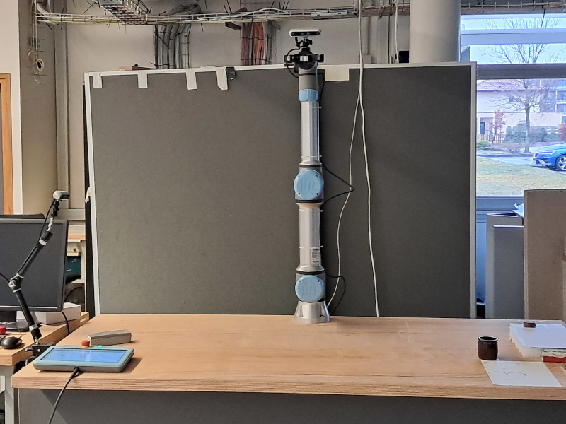

# ROS2 for Ur5 Grenoble robot (UR5-gra) 

* ur5-gra@inria.fr : mailing-list for info, questions, exchange,...
* https://mattermost.inria.fr/sed-hallerobotique/channels/plateforme-ur5: mattermost channel 



## Draft / In Progress / TODO

* [x] Explore and choose version
  * [x] ros2 humble or jazzy ? => jazzy
  * [x] gazebo 11/classic or gz/harmonic ? => gz harmonic
  * [x] how to interact with Moveit in Python => see `examples/`
* [ ] Integrate the Gripper:
  * [x] in ros2
  * [ ] in gazebo (some troubles) => Nvidia/ISAAC
  * [x] in moveit
* [ ] Integrate the intel camera:
  * [x] in gazebo
  * [ ] in moveit (make sense ?)
* [ ] Example of a real pick and place using python/Moveit
  * [ ] in simulation with gazebo
  * [ ] with the real robot
* [ ] Verify that ros2 take in account `my_robot_calibration.yaml`

## Architecture

The robotic cell is composed by:

* [ur5e](https://www.universal-robots.com/fr/produits/robot-ur5/) cobot from universal robot
  *  with a2 finger gripper [2F-85](https://www.universal-robots.com/plus/products/robotiq/robotiq-2f-85/)
  * IP: `192.168.0.2`
* Two real-sense camera:
  * one mounted on the robot wrist
  * one attached to the scene
* a host PC (Ubuntu 22.0) `wks-2hhkl34.grenoble.inria.fr`
  * on robot network, IP: `192.168.0.1`
  * on inria network, IP: `194.199.21.31`

## Pre-requisite

* Read the robot use [risk analysis](https://gitlab.inria.fr/sed-ral/ur5_gra/ur5_gra_admin/-/blob/main/ur5_analyse_risques.pdf) (in french, english version TBD)
* Have access to `wks-2hhkl34.grenoble.inria.fr`

## Getting started

If you want more details about this, we recommand to consult the section `useful links`. 

### Build docker image

For information, the ros2 is used on a docker image. It is not directly installed on the host PC. First, you need to build the docker image (verify you have the rights) `ros2-urgra`. It builds a ROS2 jazzy image.

```bash
cd dockerfile
./build.sh
```

### With the real robot

* Using the teach pendant, switch on/start the robot 
* On the PC host, Launch the minimal ros2 app: ur5e driver + rviz

```bash
cd dockerfile
./run.sh

ros2 launch ur_robot_driver ur_control.launch.py ur_type:=ur5e robot_ip:=192.168.0.2
```

* Using the teach pendant set the robot in remote mode ([In details step by step](./ur_teach_pendant.md))
  * Load and run the program ros2
  * Activate the gripper
  * Set the remote mode (icon top right)
  * Then, you will see a table with the variables exchanged with the ros2 driver.
* Launch an example through an other terminal connected to the ros2 container

```bash 
docker exec -it ros2-ur5-jazzy bash
```

On a terminal, you can launch for example:

#### Joint trajectory mode demo

Send some goal to the Joint Trajectory Controller by using a demo node
```bash
ros2 launch ur_robot_driver test_scaled_joint_trajectory_controller.launch.py
```

Send the command using demo node
```bash
ros2 launch ur_robot_driver test_joint_trajectory_controller.launch.py
```

#### MoveIt

```bash
ros2 launch ur_moveit_config ur_moveit.launch.py ur_type:=ur5e launch_rviz:=true
```

# UR5e + Robotiq Gripper Example

### Python programming

Provided the Moveit stack is already started, either on a simulated or a real robot, you can interact with it using Python programs int the ros2 framework. The directory `example` contains a basic python class and it's compagnon example program that can be used as a starting block to program arm movements with simple python functions.


#### Examples


# 1. Launch the UR5e driver
```bash
ros2 launch ur_robot_driver ur_control.launch.py \
  ur_type:=ur5e \
  robot_ip:=192.168.0.2
```

# 2. Launch MoveIt2 for the UR5e (without RViz)
```bash
ros2 launch ur5e_moveit_config ur5e_moveit_planning_execution.launch.py \
  ur_type:=ur5e \
  launch_rviz:=false
```

# 3. Run the example
```bash
cd ~/workspace/example
python3 main.py
```


### With controlbox simulation

Instead of starting the robot, you can launch a container that will emulate the controller with its teach pendant.

The first time, you need to create a network to communicate with this container.

```
docker network create --subnet=192.168.56.0/24 ursim_net
```

Then you can launch the container

```
cd docker
./run-ursim.sh
```

You can emulate the teach pendant through a web app:
```
firefox http://192.168.56.101:6080/vnc.html?host=192.168.56.101&port=6080
```

Then you can use the same sequences described in section `With the real robot` but in simulation; you need to use the IP simulation robot `robot_ip:=192.168.56.101` instead of the real `robot_ip:=192.168.0.2`.

## Useful links

### Universal robots

* Developer Network, Build things, find experts, start conversations.
  * <https://www.universal-robots.com/developer/> 
* Forum on UR users, announces,...  
  * <https://forum.universal-robots.com> 
* Some free e-learning, video tutorials for general purpose
  * <https://academy.universal-robots.com/fr/> 
* Information about our robot (pissard account)
  * <https://myur.universal-robots.com/> 

### Some specific links for UR developer

* General ros2 entry page
  * <https://www.universal-robots.com/developer/develop-with-ros/>
* Python communication lib under ros2
  * <https://www.universal-robots.com/developer/insights/client-libraries-for-external-monitoring-and-control/>

### Ros2 - Jazzy documentation

* UR robot driver:
  * <https://docs.ros.org/en/ros2_packages/jazzy/api/ur_robot_driver/index.html>
* Gazebo configuration:
  * https://github.com/UniversalRobots/Universal_Robots_ROS2_GZ_Simulation
* UR SIM controler emulation:
  * <https://docs.ros.org/en/ros2_packages/jazzy/api/ur_robot_driver/doc/installation/ursim_docker.html> 

### Realsense camera under ros2

* Ros2 realsense wrapper:
  * https://github.com/IntelRealSense/realsense-ros
* Ros2 realsense inside docker container:
  * https://github.com/2b-t/realsense-ros2-docker

### Github sources

* ros2 ur driver:
  * <https://docs.ros.org/en/ros2_packages/iron/api/ur_robot_driver/index.html>
* ros2 images:
  * <https://github.com/osrf/docker_images>

### Misc

* A getting started in french:
  * <https://innovation.iha.unistra.fr/books/robotique-open-source/chapter/4-ros2-manipulation-cobot> 

## ROS2 version

### jazzy

* LTS support from may 2024 to may 2029
* gz harmonic supported until Jan. 2028
  * conf ur: https://github.com/UniversalRobots/Universal_Robots_ROS2_GZ_Simulation


### References
This code is adapted from the INRIA'S repository, for more information please visit the original repository.
https://gitlab.inria.fr/sed-ral/ur5_gra/ur5_gra_ros2/-/tree/main?ref_type=heads
